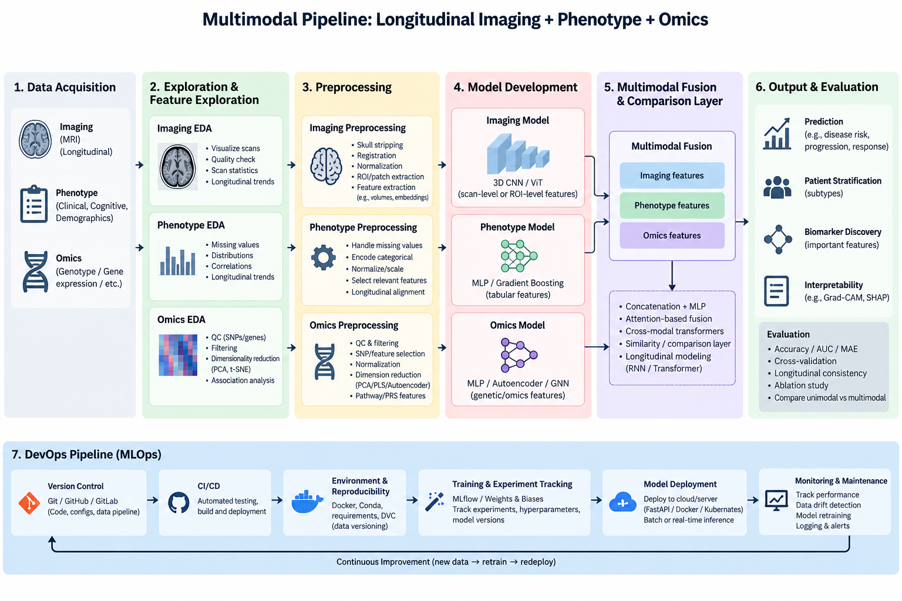

# Longitudinal_imaging_to_multimodality
Name TBA, **Project Mind-blowing**



## Architecture Overview

Federated learning system for N-back score prediction using a **Federation Head + Training Heads** architecture with mixed-effects models.

```
Federation Head (center.py)              Training Heads (worker.py)
┌─────────────────────────────┐         ┌─────────────────────────────┐
│  Global Model (Fixed Eff.)  │  HTTP   │  Local Model (Random Eff.)  │
│  FedAvg Aggregator          │◄───────►│  Local Training Only        │
│  Round Manager              │  REST   │  Never exposes raw data     │
└─────────────────────────────┘         └─────────────────────────────┘
```

**Privacy Principle:** Raw data stays local to each Training Head. Only model weights, sample counts, and metrics are shared via HTTP REST API.

### Mixed-Effects Model

- **Fixed Effects**: Global parameters shared across all Training Heads (federated)
- **Random Effects**: Local parameters learned per Training Head (site-specific)
- **FedAvg**: `W_global = (N1*W1 + N2*W2) / (N1 + N2)`

```python
MixedEffectsModel(
  (fixed_weights): Linear(in_features=10, out_features=1, bias=False)
  (random_weights): Linear(in_features=5, out_features=1, bias=False)
)
```

### REST API

| Endpoint | Method | Description |
|----------|--------|-------------|
| `/health` | GET | Health check |
| `/initialize` | POST | Load model weights |
| `/train` | POST | Start local training (async) |
| `/status` | GET | Poll training progress |
| `/weights` | GET | Retrieve local weights + sample count |
| `/evaluate` | POST | Evaluate model locally |

### Data Sources
- **Dataset**: https://openneuro.org/datasets/ds007089/versions/1.0.1
- **Imaging**: Penn LEAD MRI derivatives (structural MRI scans)
- **Phenotype**: CNB tasks, self-report, demographics (age, sex, education)

---

## How to Use

### Option 1: Docker (Recommended)
```bash
docker compose up --build
```

### Option 2: Local Testing
```bash
# Terminal 1 - Start Training Heads
python3 worker.py --center-id center1 --data-dir ./data/center1 --port 8001 &
python3 worker.py --center-id center2 --data-dir ./data/center2 --port 8002 &

# Terminal 2 - Start Federation Head
python3 center.py --training-heads http://localhost:8001 http://localhost:8002 --rounds 5 --epochs 10
```

### Option 3: Manual Smoke Test
```bash
# Check health
curl http://localhost:8001/health
curl http://localhost:8002/health

# Initialize
curl -X POST http://localhost:8001/initialize \
  -H "Content-Type: application/json" \
  -d '{"round":1,"model_version":"v1","weights":null,"weights_format":"torch_state_dict_base64"}'

curl -X POST http://localhost:8002/initialize \
  -H "Content-Type: application/json" \
  -d '{"round":1,"model_version":"v1","weights":null,"weights_format":"torch_state_dict_base64"}'

# Start training
curl -X POST http://localhost:8001/train \
  -H "Content-Type: application/json" \
  -d '{"round":1,"model_version":"v1","epochs":1}'

curl -X POST http://localhost:8002/train \
  -H "Content-Type: application/json" \
  -d '{"round":1,"model_version":"v1","epochs":1}'

# Poll status
curl http://localhost:8001/status
curl http://localhost:8002/status

# Retrieve weights (after both complete)
curl http://localhost:8001/weights
curl http://localhost:8002/weights
```

---

## Checklist

### Implemented
- [x] Federation Head (`center.py`) - orchestrates Training Heads, aggregates via FedAvg
- [x] Training Head (`worker.py`) - Flask REST API, local training only
- [x] Mixed-effects model with fixed and random effects
- [x] FedAvg aggregation with sample-weighted averaging
- [x] Async training with polling
- [x] Base64-encoded PyTorch state_dict serialization
- [x] Round management for multi-round training
- [x] Training metrics logging
- [x] Model checkpoint saving

### Outstanding
- [ ] Integrate with real MRI/phenotype data
- [ ] Structural MRI loading and preprocessing pipeline
- [ ] Phenotypical data integration with training progress
- [ ] Visualization dashboard for training progress
- [ ] Docker Compose for new architecture
- [ ] Multi-center coordination and data governance
- [ ] Model validation and cross-validation
- [ ] Authentication and security for HTTP communication

---

## Project Directory Structure

```
longitudinal_imaging_to_multimodality/
├── center.py                  # Federation Head (HTTP orchestrator + FedAvg)
├── worker.py                  # Training Head (Flask REST API + local training)
├── requirements.txt           # torch, numpy, flask, requests
├── docker-compose.yml         # Docker orchestration
├── Dockerfile.federation-head # Docker image for Federation Head
├── Dockerfile.training-head   # Docker image for Training Heads
├── workflow.png               # Architecture diagram
├── doc/
│   ├── agents.md              # Agents administration guide
│   ├── architecture_design_record.md
│   ├── 202609181219-FEDERATION_HEAD_HANDOFF.md  # API spec
│   └── ...
├── src/
│   ├── config.py              # Configuration and constants
│   ├── phenotype_model.py     # Phenotype embedder model
│   └── ...
├── data/
│   └── processed/             # Processed data
├── federation_model.pt         # Saved global model (after training)
└── federation_metrics.json     # Training metrics (after training)
```

---

## Configuration

### Federation Head (`center.py`)

| Parameter | Default | Description |
|-----------|---------|-------------|
| `--training-heads` | `http://localhost:8001 http://localhost:8002` | Training Head URLs |
| `--rounds` | 5 | Number of federated rounds |
| `--epochs` | 10 | Local epochs per round |
| `--n-fixed-features` | 10 | Fixed effect features |
| `--n-random-features` | 5 | Random effect features |
| `--poll-interval` | 1.0 | Polling interval (seconds) |

### Training Head (`worker.py`)

| Parameter | Default | Description |
|-----------|---------|-------------|
| `--center-id` | (required) | Center identifier |
| `--data-dir` | (required) | Path to data directory |
| `--port` | 8001 | Port to listen on |
| `--host` | 0.0.0.0 | Host to bind to |
| `--n-fixed-features` | 10 | Fixed effect features |
| `--n-random-features` | 5 | Random effect features |

---

## Docker Commands
```bash
# Start all containers
docker compose up --build

# Stop all containers
docker compose down

# View logs
docker compose logs -f
```

---

## Privacy Boundary

The Federation Head must never read or mount Training Head data directories:

```text
data/centers/center1    ← Training Head 1 only
data/centers/center2    ← Training Head 2 only
```

Only these are shared via REST API:
- Center ID
- Round number
- Model version
- Sample count
- Metrics (loss, MAE)
- Model weights (base64-encoded state_dict)

---

## Resources

- https://openneuro.org/datasets/ds007089/versions/1.0.1
- https://openneuro.org/datasets/ds007116/versions/1.0.6
- https://github.com/collaborativebioinformatics/Longitudinal_imaging_to_multimodality
- https://github.com/IBM/comical/tree/main
