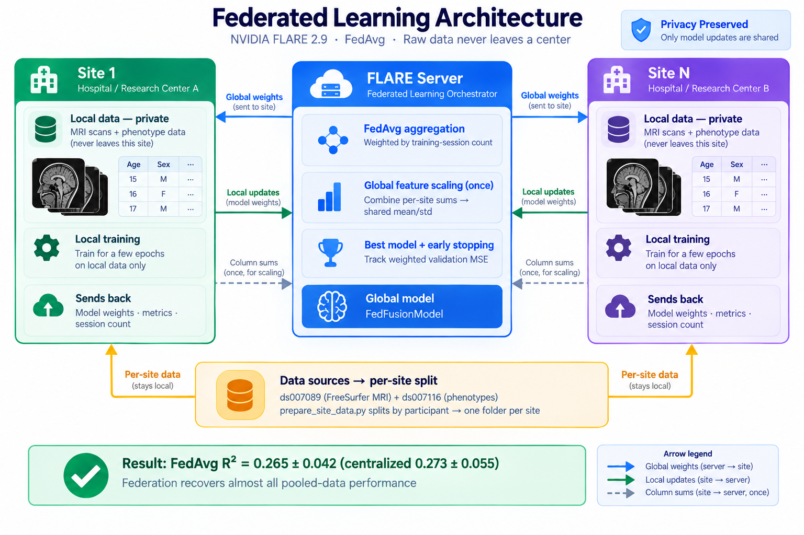
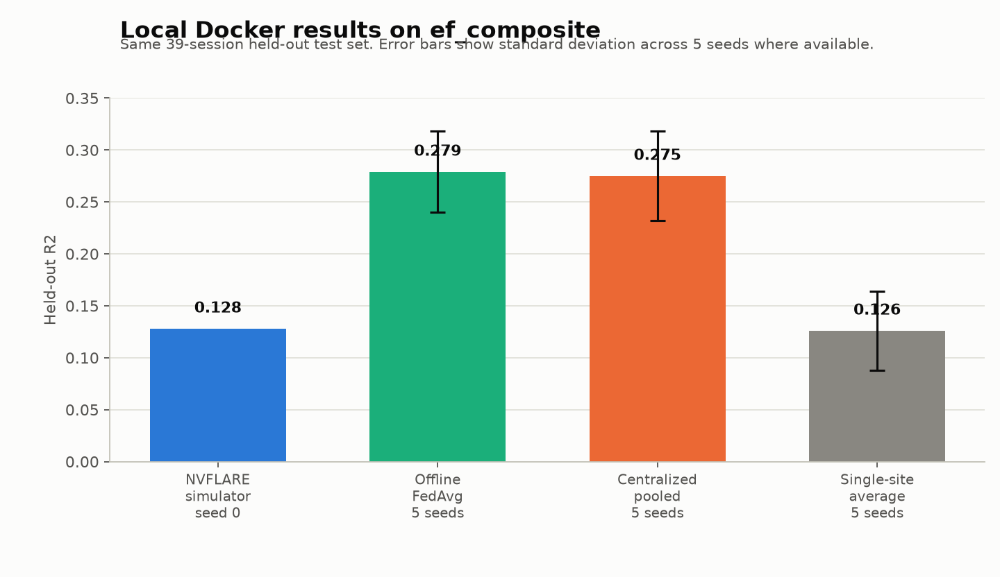
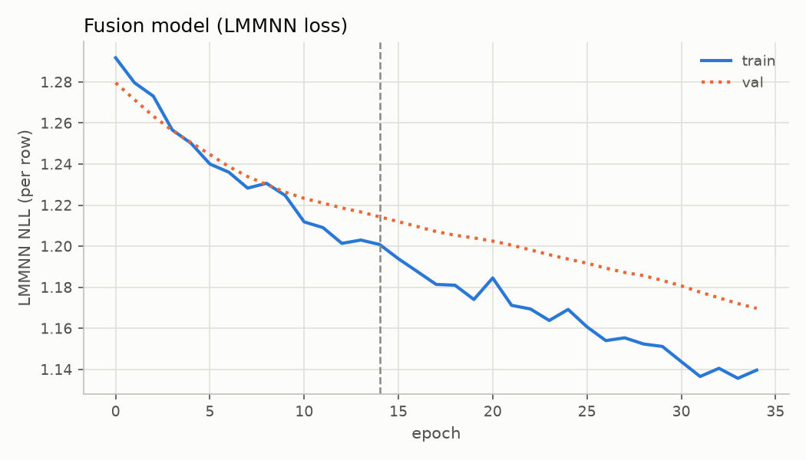
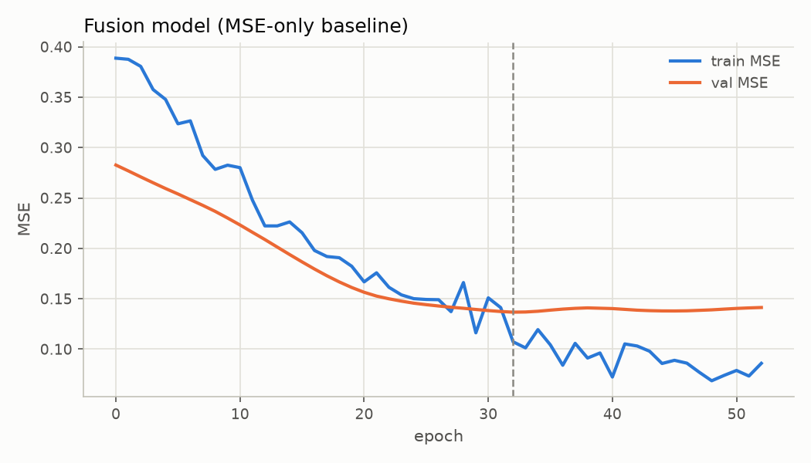
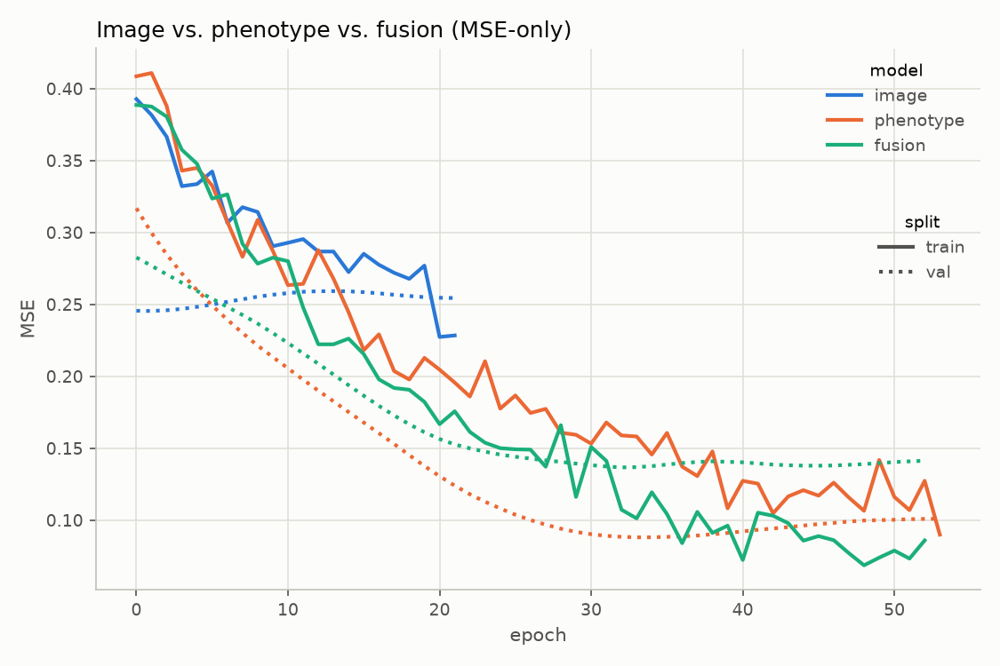

# Cogni warriors 🧠⚔️

*We will blow your mind.*


*Data and study workflow.*



*Federated learning architecture — NVIDIA FLARE 2.9 (FedAvg) with global feature scaling.*

---

## 1. Using phenotypes to predict cognitive progression

Our federated-learning proof of concept predicts **cognitive progression** — an
executive-function (EF) composite measured at each imaging session — **structural-MRI** paired with **phenotypical** information.

- **Data**: Penn LEAD — behavioral/phenotype and structural-MRI
  [OpenNeuro `ds007116`](https://openneuro.org/datasets/ds007116/versions/1.0.6)
   source
  (~1.5 GB of FreeSurfer T1w derivatives, `sourcedata>freesurfer>any>mri>*.mgz`
  — 223 volumes + phenotype tables, organized into 4 centers) —
  **132 adolescents, 225 imaging sessions** (59 subjects with 1 session, 53 with
  2, 20 with 3), 3 diagnostic groups (TD/NC, ADHD, PRO/CHR).
  - **Structural-MRI embedding**: Processed with FreeSurfer
    ([`ds007089`](https://openneuro.org/datasets/ds007089/versions/1.0.1)).
  - **Phenotypes**: Cheap, low-burden measures (demographics, a non-target battery of
computerized cognition tasks, self-report scales, and pubertal staging) plus a
**structural-MRI embedding**, with no cognitive testing battery required to make
a prediction.
- **Modeling unit = each imaging session**, not each subject — every session has
  its own EF composite and (eventually) its own structural features.
- This gives a biobank a one-stop surface for *cognitive outcome prediction*,
  tracked across repeated visits.

## 2. Challenges: Very longitudinal, repeated observations, random-effects, and fighting data silos.

- **Very longitudinal**: MR data is typically recorded over a long time. The [OpenNeuro `ds007089`](https://openneuro.org/datasets/ds007089/versions/1.0.1) dataset has upto 3 sessions per subject recorded over ~1–1.5 years. 
  - Consequence: A plain regression wrongly treats these as independent rows — within-subject correlation must be modeled explicitly, which leads directly to **random effects**.
- **Repeated observations** → Solution we can use a random-effects model!
  - the LMMNN loss replaces MSE
  with the negative log-likelihood of a Gaussian whose covariance has a
  **per-subject random intercept** plus i.i.d. error
  (`V = σ²_subject · ZZᵀ + σ²_error · I`), optimized jointly with the network
  weights — no EM, no alternating steps.
- **Proof of concept enabling data centers**: data are naturally siloed (clinics,
  health centers, biobanks, countries). Federated learning on **NVIDIA FLARE 2.9**
  lets every center train only on its own data and share *weights, metrics,
  session counts, and aggregate column sums* — never records. See §5.

## 3. Method: Outcomes of interest

One continuous target per session — the **EF composite** — the mean of 5 CNB
(Penn Computerized Neurobehavioral Battery) task z-scores:

| Task | Construct |
|---|---|
| N-back (`cnb_lnb_mcr`) | working memory |
| PCET (`cnb_pcet_cr`) | abstraction / set-shifting |
| AIM (`cnb_aim_aimtot`) | abstraction / inhibition / WM |
| CPT (`cnb_cptnl_total_sen`) | sustained attention / inhibition |
| Trail Making B (`cnb_trails_rtcr`, sign-flipped) | cognitive flexibility |

- Z-scored across the sample; **higher ≡ better** for every task.
- Requires ≥2 of 5 tasks passing QC (`valid_code ∈ {V, VC, F, 0}`) → **217/225
  sessions** receive a composite; the 8 without are excluded.
- The **5 per-task z-scores are also available** as an alternative target set —
  flip `config.TARGET_COLUMNS` and the whole pipeline (model output size, loss,
  batching) adapts.
- Diagnosis is deliberately *not* the outcome: a continuous EF trait is
  transdiagnostic and harmonizes across differently-instrumented biobanks.

## 4. Method: Predictors

**Phenotype inputs** (97 columns after selection from an initial 161, pruned by
univariate association, redundancy, and VIF — see
`pending_cleanup/docs/project_docs/results.md` for the archived project notes):

- **Demographics + diagnosis flags** one-hot encoded: `study_group`, `sex`,
  `race`, `ethnicity`, and 10 `dx_*` diagnostic flags.
- **26 non-EF CNB cognition columns** (accuracy + RT), QC-gated identically to
  the EF tasks.
- **8 trimmed self-report scales** (BIS/BAS reward responsivity, ARI, ASRM,
  RPAS, MAP-SR, Wolf IM/EM, E-SWAN ADHD inattention, PRIME).
- **Tanner pubertal staging** (sex-coalesced mean stage).
- Missing values: median/mode imputation, each paired with a
  `<col>_was_missing` indicator so the missingness pattern itself is usable
  signal (~10% of cells imputed, concentrated in self-report scales).
- **Covariates**: per-session `age` and `session_index` (1/2/3), concatenated
  at the head — not through the embedder.

**Image inputs**: a precomputed **80-dim structural-MRI embedding** per session,
projected by a small trainable `ImageEmbedder` (the repo has no raw-image
pipeline — this plays the role a CNN encoder would). The embeddings are derived
from FreeSurfer segmentations of the T1w volumes in
[`ds007089`](https://openneuro.org/datasets/ds007089/versions/1.0.1). Image
signal alone is weak (R²≈0.12); phenotype alone is strong (R²≈0.6+); the fused
model is the point.

## 5. Method: Multi-Modal Architecture and Federation

**Architecture — late fusion of small, regularized MLPs** (~19.8k parameters):

```
ImageEmbedder:      Linear(80 → 64) → LayerNorm → ReLU → Dropout(0.4)
                     → Linear(64 → 32) → ReLU → Dropout(0.3)
PhenotypeEmbedder:   Linear(91 → 64) → LayerNorm → ReLU → Dropout(0.4)
                     → Linear(64 → 32) → ReLU → Dropout(0.3)
FusionRegressor:     concat(z_img[32], z_pheno[32], covariates[2]) = 66
                     → Linear(66 → 64) → ReLU → Dropout(0.3)
                     → Linear(64 → n_targets)
```

- **LMMNN loss** replaces MSE: Gaussian NLL with per-subject random intercept,
  minibatched with subject-grouped sampling (closed-form Sherman–Morrison — no
  dense matrix inverses).
- **Federation (NVFLARE 2.9 FedAvg)** —
  `training_docker_v1/federated/flare/`:
  1. **Global scaling (once)**: the server combines per-site column
     sums/sums-of-squares/counts into one global mean/std, stored *inside* the
     model (`FedFusionModel` buffers) so every site scales identically and the
     saved model takes raw features.
  2. **FedAvg rounds**: server → sites → local training → weights back;
     averaged weighted by each site's training-session count.
  3. **Best model + early stopping** on weighted validation MSE (`--patience`).
- Sites' training data is split **by participant** (`prepare_site_data.py`); the
  held-out test set is the same 20% of participants used by the centralized pipeline.
  In a real deployment, each of the 4 centers of the
  [`ds007089`](https://openneuro.org/datasets/ds007089/versions/1.0.1) split acts
  as one federated site.
- `--loss mse` federates fixed effects only; `--loss lmmnn` additionally
  federates the two random-effect variance terms.
- `job.py` runs it as simulator (`sim`), POC processes (`poc`), an exported job
  (`export`), or a provisioned real deployment (`prod`, `project.yml` + Docker).

## 6. Results & Future Work

**Results** (`ef_composite`, same 39-session held-out test as the centralized
pipeline):

| Setting | R² |
|---|---|
| NVFLARE FedAvg, 4 sites (local simulator, seed 0) | 0.128 |
| Offline FedAvg simulation, 5 local seeds | 0.279 ± 0.039 |
| Centralized (all data pooled), 5 local seeds | 0.275 ± 0.043 |
| Single site alone, 5 local seeds | 0.126 ± 0.038 |

Local Docker calculation details: active `training_docker_v1` code/data,
`ef_composite`, IID 4-site split, MSE loss, same 39-session held-out test set.
The NVFLARE simulator row used seed 0, 100 max rounds, 3 local epochs, and
stopped after 37 rounds (`MSE=0.5673`, `MAE=0.5268`). The offline comparison
rows used seeds 0-4, 150 max rounds, and 3 local epochs.



Additional local LMMNN sanity run: seed 0, grouped 143/33/39
train/validation/test session split, held-out `R²=0.239` (`model_MSE=0.4959`,
`mean_baseline_MSE=0.6518`, `n_test=39`).







**In the local offline comparison, FedAvg recovers pooled-data performance
without moving a single record.**

- **Modularity** — every block is swappable: swap the image embedder for
  vertex-wise/functional-connectivity/raw-volume features, swap the 1 target for
  the 5 EF sub-scores, swap the loss, and the rest of the pipeline adapts.
- **Late fusion** — a clean seam to bolt on further modalities (genotype,
  omics, actigraphy…) as independent embedders feeding one head.
- **Cooperative** — a working, multi-site federated blueprint: data silos
  (hospitals, biobanks, countries) cooperate while keeping data private; the
  global-scaling step proves harmonization is possible even when sites
  instrument differently.
- **Biobanks / longitudinal** — session-level rows + per-subject random effects
  make repeated-observation modeling natural; the per-subject random effect is
  the first step toward a *site/scanner* random effect for cross-center
  heterogeneity.
- **Blueprint / multimodality and enabling possibilities** — an open,
  reproducible template for shipping a new data center or a new modality into
  the federation, and for demonstrating that multi-institution cognitive
  research is feasible (e.g. the planned 2027 Clinical Hackathon).

---

## Quick Start

### 1. Install
```bash
pip install -r training_docker_v1/requirements-flare.txt  # nvflare==2.9.0 is pinned on purpose
```

### 2. Prepare the site data
```bash
python training_docker_v1/federated/flare/prepare_site_data.py --n-sites 4
```

### 3. Train & evaluate (simulator)
```bash
python training_docker_v1/federated/flare/job.py --mode sim --n-sites 4 --rounds 100
python training_docker_v1/federated/flare/evaluate_global.py \
  --model /tmp/nvflare/cogniwarriors/cogniwarriors_fedavg/server/simulate_job/app_server/best_FL_global_model.pt
```

### Full options (`training_docker_v1/federated/flare/job.py`)

| Flag | Default | Meaning |
|---|---|---|
| `--mode` | `sim` | `sim`, `poc`, `export`, or `prod` |
| `--n-sites` | 4 | Sites that must join every round |
| `--rounds` | 50 | Maximum number of rounds |
| `--local-epochs` | 3 | Local epochs per round |
| `--patience` | 20 | Stop after N rounds without val improvement |
| `--loss` | `mse` | `mse` (fixed effects) or `lmmnn` (+ random-effect variances) |
| `--mu` | 0 | FedProx strength (0 = plain FedAvg) |
| `--data-root` | `training_docker_v1/federated/flare/data` | Folder of per-site data folders |

Real deployment (separate machines): build the runtime image
(`docker build -t cogniwarriors-flare:latest -f training_docker_v1/federated/flare/Dockerfile training_docker_v1`),
provision with
`nvflare provision -p training_docker_v1/federated/flare/project.yml -w provision_workspace`,
ship each startup kit only to its owner, start server + sites with
`./startup/start.sh` (or `docker.sh`), and submit the job with `--mode prod`.
For the Docker dashboard and smoke-test runbook, see `training_docker_v1/README.md`.

---

## Local (non-federated) pipeline

```bash
# Phenotype pipeline: EF composite → 97-column phenotype matrix
python preprocessing/build_ef_composite.py
python preprocessing/build_phenotype_input.py
python training/train_phenotype_sanity.py        # GroupKFold sanity check

# Fused image + phenotype model with LMMNN random-effects loss
python training/train_fusion_lmmnn.py            # trains + saves results/
```

For FLARE runs, add `--loss lmmnn` to the `job.py` command to federate the two
LMMNN variance terms.

---

## Project Directory Structure

```
├── training/                    # Centralized pipeline + fusion model
│   ├── config.py                # Targets, features, architecture, hyperparameters
│   ├── fusion_model.py          # ImageEmbedder, FusionRegressor, SingleModalityRegressor
│   ├── lmmnn_loss.py            # LMMNN random-effects loss
│   ├── multimodal_data.py       # Data join + subject-grouped batch sampler
│   ├── checkpoint.py            # Self-describing checkpoint + predict API
│   ├── train_fusion_lmmnn.py    # Main training entrypoint
│   └── train_phenotype_sanity.py
├── preprocessing/               # EF composite, phenotype feature, and MRI preprocessing
│   ├── build_ef_composite.py    # EF composite builder
│   ├── build_phenotype_input.py # Phenotype feature matrix builder
│   └── segment_brain.py         # MRI segmentation helper
├── scripts/                     # OpenNeuro download, architecture search, model-family search
├── training_docker_v1/          # Docker dashboard + active NVFLARE workflow
│   ├── federated/
│   │   └── flare/               # NVFLARE federation (client, controller, model, job)
│   ├── monitor_app/             # Web monitor API and UI
│   ├── docker-compose.yml       # Dashboard container entrypoint
│   └── README.md                # Runbook and API order
├── pending_cleanup/             # Archived notes, legacy prototypes, and generated artifacts
└── README.md
```

---

## Privacy Boundary

The NVFLARE server sees only model weights, metrics, session counts, and
(once) per-column sums / sums-of-squares / counts for global feature scaling —
aggregate information, never individual records. Each site's raw data folder
(`data/`) is readable only by that site.

## Resources

- https://openneuro.org/datasets/ds007116/versions/1.0.6 — Penn LEAD behavioral / phenotype data
- https://openneuro.org/datasets/ds007089/versions/1.0.1 — Penn LEAD FreeSurfer structural-MRI data
- https://github.com/collaborativebioinformatics/Longitudinal_imaging_to_multimodality
- https://github.com/IBM/comical/tree/main
